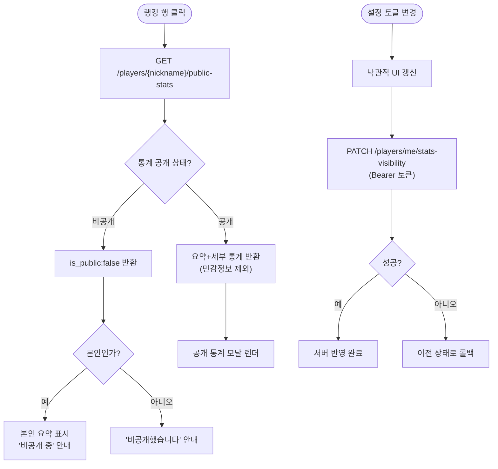

# ⚙️[기능추가][랭킹] 랭킹 프로필 통계 보기 + 통계 비공개 설정

## 개요

랭킹에서 다른 플레이어를 클릭하면 그 사람의 **공개 통계**를 모달로 볼 수 있게 하고, 설정에 **통계 공개/비공개 토글**을 추가했다. 남에게 보여주는 데이터는 실력·성과 지표만 공개하고, 시간대별 플레이 습관·세션 간격·단어 약점 같은 민감 정보는 서버 단에서 응답에 포함하지 않는다. 비공개 판단은 전적으로 서버에서 처리한다.

## 기능 흐름

## 변경 사항

### DB / 마이그레이션
- `backend/src/models/player.py`: `is_stats_public` 컬럼 추가 (`Boolean`, `default=True`). 모든 플레이어는 기본 공개 상태로 시작.
- `backend/alembic/versions/0004_player_stats_public.py`: `ALTER TABLE players ADD COLUMN IF NOT EXISTS is_stats_public BOOLEAN NOT NULL DEFAULT TRUE`. 배포 시 entrypoint의 `alembic upgrade head`로 자동 적용 (수동 SQL 불필요).

### 백엔드 API
- `backend/src/apis/stats_router.py`: `GET /players/{nickname}/public-stats` 신규. 비공개·미존재 플레이어는 `{is_public:false}`만 반환. 공개 시 요약/세부평균/추세/백분위/스테이지별 최고점/단어 강점을 반환하되, `habit`(시간대·세션간격)과 `words.hardest`(약점 단어)는 의도적으로 제외.
- `backend/src/apis/player_router.py`: `PATCH /players/me/stats-visibility` 신규 (Bearer 토큰으로 본인 인증). `PlayerResponse`에 `is_stats_public` 필드 추가.
- `backend/src/services/player_service.py`: `set_stats_visibility`, `is_stats_public` 헬퍼 추가.

### 프론트엔드
- `src/components/PublicStatsModal.tsx`: 신규 컴포넌트. 로딩/공개/비공개/오류 상태 분기, 본인은 비공개여도 조회 가능. 기본 요약 + 세부 기록 + 최근 활동 + 스테이지별 최고점 + 단어 강점 섹션.
- `src/components/RankingScreen.tsx`: 랭킹 행(및 sticky 내 행) 클릭 시 모달 오픈.
- `src/components/StartScreen.tsx`: 설정 화면에 "통계 공개" 토글 추가 (로그인 상태에서만 표시).
- `src/App.tsx`: `isStatsPublic` 상태 관리 — `getPlayer` 응답으로 초기화, 토글 시 낙관적 업데이트 + 실패 롤백.
- `src/services/statsService.ts`: `getPublicStats`, `setStatsVisibility` 및 `PublicStatsResponse` 타입.
- `src/services/playerService.ts`: `PlayerRecord`에 `is_stats_public` 추가.

## 주요 구현 내용

- **민감정보 분리**: 본인 전용 `/stats`는 전체 통계를 그대로 유지하고, 남에게 보여줄 데이터는 신규 `/public-stats`로 완전히 분리했다. 약점·습관 데이터는 공개 응답 구조 자체에 포함되지 않아, 프론트가 실수로 노출할 여지가 없다.
- **비공개 판단은 서버 책임**: 프론트는 받은 데이터만 렌더한다. 공개 여부는 서버가 `is_public` 플래그로 결정한다.
- **본인 예외 처리**: 본인이 비공개로 설정해도 본인 행 클릭 시 요약을 볼 수 있고 "비공개 중" 안내를 함께 표시한다.
- **라우트 순서**: `/players/me/stats-visibility`를 `/players/{nickname}`보다 먼저 등록해 `me`가 닉네임으로 오인되지 않도록 했다.
- **낙관적 업데이트**: 토글은 즉시 UI에 반영하고, 서버 저장 실패 시에만 이전 상태로 롤백한다.

## 주의사항

- 통계 공개 토글은 **로그인(닉네임) 상태에서만** 설정 화면에 노출된다. 비로그인 사용자에게는 통계 개념 자체가 없으므로 표시하지 않는다.
- 단어 분석 섹션은 해당 플레이어의 word_stats 데이터가 없으면(played=0) 조건부로 생략된다.
- 공개 모달은 섹션이 많아 `max-height` + 스크롤로 처리한다.

Closes #143
